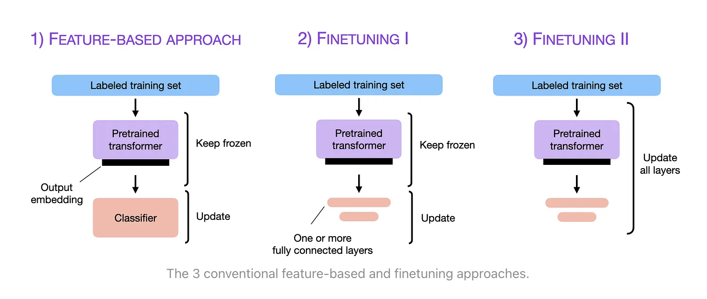

# Introduction to Fine-tuning

## **Ali Masri**

### Machine Learning Engineer | Ford Motor Company

<p>
  <a href="https://www.linkedin.com/in/alimasri/" rel="nofollow noreferrer">
     https://www.linkedin.com/in/alimasri/
  </a> <br />
  <a href="https://github.com/alimasri" rel="nofollow noreferrer">
     https://github.com/alimasri
  </a>
</p>

---

## Takeaways

<div style="float: left; width: 60%">

- What is fine-tuning?
- Fine-tuning methods
- Challenges
- Parameter Efficient Fine-tuning (PEFT)
- Fine-tune a model with Low-Rank Adaptation (LoRA)

</div>

<div align="center" style="float: left; width: 40%">


<https://github.com/alimasri/introduction-to-finetuning>

</div>

---

<!-- paginate: true -->

## Fine-tuning

<div>

- Training a large language model from scratch is incredibly expensive
  - resources
  - time
- Model fine tuning is a process where a **pre-trained model** is further trained (or **"fine tuned"**) on a smaller, domain-specific dataset.

</div>

<center>
<div style="width: 70%">

</div>
</center>

---

## When to fine-tune?

- **Domain Expertise** - Improve accuracy in specialized fields (e.g., legal, medical).  
- **Custom Style & Tone** - Align responses with brand voice or specific writing styles.  
- **Proprietary Data** - Train on private datasets unavailable in base models.  
- **Task-Specific Optimization** - Enhance performance in summarization, coding, etc.  
- **Multilingual Support** - Improve performance in low-resource languages.  
- **Efficient Deployment** - Optimize for smaller, faster models.  

---

## When not to fine-tune?

- **General Use Cases** - When the base model already performs well.  
- **Few-Shot Learning Works** - If prompt engineering or examples achieve the desired results.  
- **High Cost & Complexity** - Fine-tuning requires significant compute resources and expertise.  
- **Frequent Data Updates** - If the knowledge changes often, **retrieval-augmented generation (RAG)** may be better.  

---

## Fine-tuning (Old School)

<div style="text-align: center; width: 100%">



</div>

<!--

1- Feature-based: It uses a pre-trained LLM as a feature extractor, transforming input text into a fixed-sized array. A separate classifier network predicts the text's class probability in NLP tasks. In training, only the classifier's weights change, making it resource-friendly but potentially less performant.
2. Finetuning I: Finetuning I enhances the pre-trained LLM by adding extra dense layers. During training, only the newly added layers' weights are adjusted while keeping the pre-trained LLM weights frozen. It has shown slightly better performance than the feature-based approach in experiments.
3. Finetuning II: In this approach, the entire model, including the pre-trained language model (LLM), is unfrozen for training, allowing all model weights to be updated. However, it may lead to catastrophic forgetting, where new features overwrite old knowledge. Finetuning II is resource-intensive but delivers superior results when maximum performance is needed.

-->

<!-- _footer: https://www.lakera.ai/blog/llm-fine-tuning-guide -->

---

## Challenges from a Business Usecase

- OpenAI provides a **fine-tuning service** for their models.
- Using old school methods, OpenAI would have to create and fine-tune a separate model for each customer.
- Aside from the computational cost, this would also require a lot of storage space.
  - GPT-3 model has **175B parameters** $\approx$ **350GBs**
  - GPT-4 model is suspected to have $\approx$ **1.7T parameters** $\approx$ **6.8TBs** :warning:

<!-- _footer: |
    https://platform.openai.com/docs/guides/fine-tuning
    https://seifeur.com/gpt-4-model-size/
-->

---


---


---

## Backpropagation in Neural Networks

<div align="center">

</div>

<!-- _footer: https://hmkcode.com/ai/backpropagation-step-by-step/ -->

---


---


---

## Gradient Descent Algorithm

<div style="display: flex; align-items: center">
<div style="float:left; width:50%; valign: center;">

</div>
<div style="float:left; width:50%">

</div>
</div>

<!-- _footer: <https://medium.com/@msong507/gradient-descent-intuitive-overview-43e7869e1545> -->

---

## The Problem

$$ W \leftarrow W - \alpha \frac{dE}{dW} $$


---

## The Idea Behind LoRA

<div style="float: left; width: 50%">

- Given a **layer** in a neural network
  - freeze the original weight matrix
  - train a separate weight matrix
  - use the new matrix to update the original matrix output

$$  Wx + \Delta W $$

<div align="center">

:warning: **But $W$ and $\Delta W$ must have the same size for the addition to work!**

</div>

</div>
<div align="center" style="float: left; width: 50%">

</div>

---

## Matrix Multiplication

<div align="center">


</div>

---

## Matrix Decomposition


$\Delta W \in \mathbb{R}^{m \times n} \rightarrow (A \in \mathbb{R}^{m \times r}) \times (B \in \mathbb{R}^{r \times n}) \mid r \text{ is the rank}$

---

## Matrix Decomposition

<div align="center">

</div>

<!-- _footer: Lora Paper https://arxiv.org/abs/2106.09685 -->

---

## Evaluation

- **25%** speedup during training on the **GPT-3 175B**
- Reduced the checkpoint size by **10,000 times (350GB $\rightarrow$ 35MB)**.


---


---

<!-- _paginate: false -->

# Implementing LoRA in PyTorch

---

## LoRa Layer

```python
class Lora(torch.nn.Module):
  def __init__(
        self,
        in_features: int,
        out_features: int,
        rank: int,
        alpha: float
    ):
    super().__init__()
    self.alpha = alpha
    self.A = torch.nn.Parameter(torch.randn(in_features, rank))
    self.B = torch.nn.Parameter(torch.zeros(rank, out_features))
  
  def forward(self, x):
    return self.alpha * (x @ self.A @ self.B)
```

---

## Fake LLM

```python
class FakeLLM(torch.nn.Module):
  def __init__(self, in_features: int, out_features):
    super().__init__()
    self.in_features = in_features
    self.out_features = out_features
    self.fc1 = torch.nn.Linear(in_features, 128)
    self.fc2 = torch.nn.Linear(128, 64)
    self.fc3 = torch.nn.Linear(64, 32)
    self.fc4 = torch.nn.Linear(32, out_features)
  
  def forward(self, x):
    x = x.view(-1, self.in_features)
    x = torch.relu(self.fc1(x))
    x = torch.relu(self.fc2(x))
    x = torch.relu(self.fc3(x))
    x = self.fc4(x)
    return x
```

---

## Modified Network

<div style="float: left; width: 70%">

```python
class FakeLLMWithLora(torch.nn.Module):
    def __init__(self, model, rank=2, alpha=0.5):
        super().__init__()
        self.model = model
        for param in self.model.parameters():
            param.requires_grad = False
        self.lora_layer_1 = Lora(model.fc1.in_features, model.fc1.out_features, rank, alpha)
        self.lora_layer_2 = Lora(model.fc2.in_features, model.fc2.out_features, rank, alpha)
        self.lora_layer_3 = Lora(model.fc3.in_features, model.fc3.out_features, rank, alpha)
    
    def forward(self, x):
        x = x.view(-1, self.model.in_features)
        x = torch.relu(self.model.fc1(x) + self.lora_layer_1(x))
        x = torch.relu(self.model.fc2(x) + self.lora_layer_2(x))
        x = torch.relu(self.model.fc3(x) + self.lora_layer_3(x))
        x = self.model.fc4(x)
        return x
```

</div>

<div align="center" style="float: left; width: 30%">

</div>

---

# Demo

## Google Colab Notebook

<https://drive.google.com/file/d/1hVrY3edfO_-9bu0TKp93N_pUTpx7JbPp/view>


